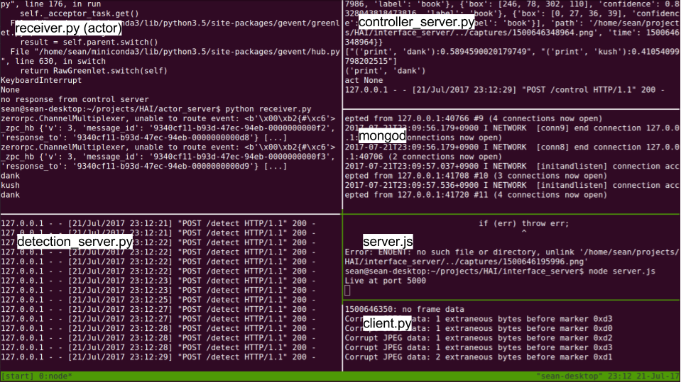
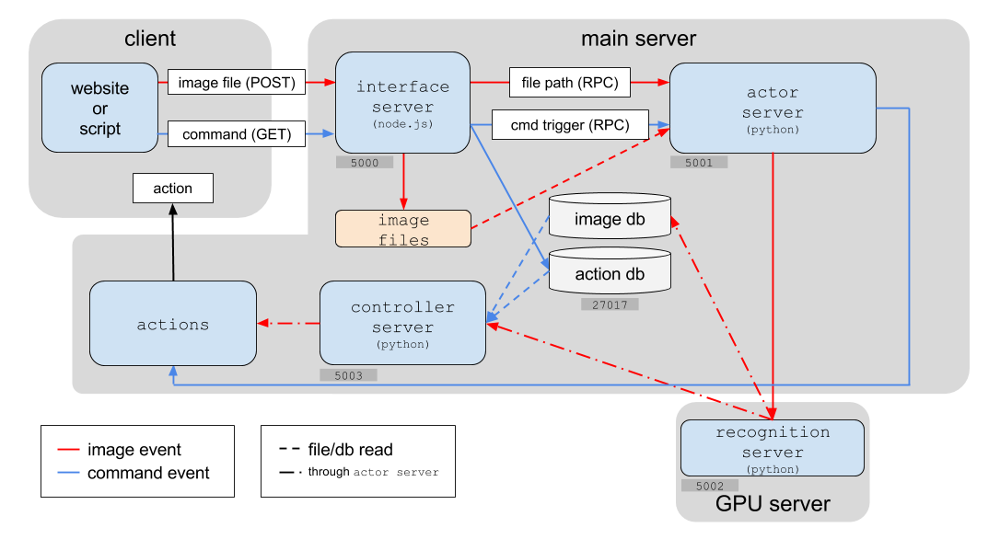

## setup
* install node+npm (```brew install node```)
* install mongodb
* ```npm install```

## complete launch
* (in recognition_server) ```python detect_server.py```
* (in controller_server) ```python control_server.py```
* (in actor_server) ```python receiver.py```
* (in interface_server) ```node server.js```
* (in cam) ```python client.py```

## example console image


## schematic


## ports
* 5000: website <-> interface server
* 5001: interface server <-> actor server
* 5002: object detection server
* 5003: action prediction server
* 27017: mongodb
